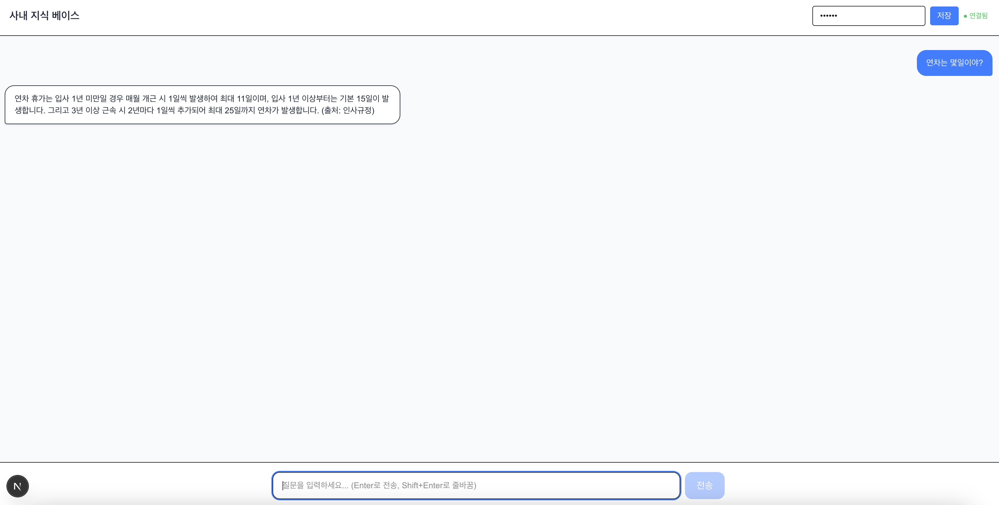

# 사내 지식 베이스

MCP 기반 권한관리가 도입된 RAG 용 사내 지식 베이스입니다.



## 아키텍처

```
자체 챗봇 UI (Next.js)
        │  Bearer token
        ▼
FastAPI (http://localhost:8000)
 ├── /api/qa        → Q&A (일반 응답)
 ├── /api/qa/stream → Q&A (스트리밍 응답)
 └── /mcp           → MCP 서버 (외부 MCP 클라이언트 연결용)
        │  user_roles 추출
        ▼
LangGraph ReAct Agent
        │  search_docs 툴 호출
        ▼
Qdrant (payload_filter → allowed_roles)
        │  허용된 문서만 반환
        ▼
LLM (OpenAI / vLLM / SGLang) → 답변 생성
```

## 프로젝트 구조

```
company_ai/
├── src/
│   ├── api/
│   │   ├── main.py               # FastAPI 진입점
│   │   ├── auth.py               # API Key 인증 (Bearer token → roles)
│   │   └── routers/
│   │       └── qa.py             # Q&A REST API (일반 + 스트리밍)
│   ├── agent/
│   │   ├── graph.py              # ReAct Agent (LangGraph)
│   │   ├── llm.py                # LLM / 임베딩 팩토리 (OpenAI / Gemini / Anthropic)
│   │   ├── prompt.py             # 시스템 프롬프트
│   │   ├── state.py              # Agent 상태 정의
│   │   └── tools/
│   │       ├── base.py           # 벡터 검색 (ACL payload_filter 포함)
│   │       └── doc_search.py     # 사내 문서 검색 Tool
│   ├── services/
│   │   └── qa.py                 # Q&A 비즈니스 로직 (일반 + 스트리밍)
│   ├── ingest/
│   │   ├── base.py               # BaseReader 추상 클래스
│   │   ├── local.py              # 로컬 파일 Reader (txt, md, pdf, docx)
│   │   ├── notion.py             # Notion Reader
│   │   ├── confluence.py         # Confluence Reader
│   │   ├── onedrive.py           # OneDrive Reader
│   │   └── upload.py             # Qdrant 적재 스크립트
│   ├── chunker/
│   │   └── token.py              # 텍스트 청킹
│   ├── mcp_server.py             # MCP 서버 (FastMCP)
│   └── config.py                 # 환경 변수 관리
├── frontend/                     # Next.js 챗봇 UI
├── docs/                         # 테스트용 사내 문서
│   ├── 인사규정.md
│   ├── 복리후생.md
│   └── IT보안정책.md
├── assets/
│   └── screenshot.png
├── Dockerfile
├── docker-compose.yml
└── .env.example
```

## 시작하기

### 1. 환경 변수 설정

```bash
cp .env.example .env
```

**필수 항목**

```env
LLM_PROVIDER=openai
LLM_MODEL=gpt-4.1-mini
DENSE_MODEL=text-embedding-3-small
OPENAI_API_KEY=your-key

# API Key → roles 매핑
API_KEYS={"my-secret-key": ["all"], "hr-key": ["hr", "all"]}
```

**vLLM / SGLang 온프레미스 서버 사용 시**

```env
LLM_PROVIDER=openai
LLM_MODEL=모델명
OPENAI_API_KEY=dummy
OPENAI_BASE_URL=http://내부서버:8000/v1
```

### 2. Qdrant 실행

```bash
docker compose up qdrant -d
```

### 3. 문서 적재

```bash
# 로컬 파일 (txt, md, pdf, docx)
uv run python src/ingest/upload.py --source local --path ./docs --roles all --reset

# 특정 역할만 접근 가능하도록
uv run python src/ingest/upload.py --source local --path ./hr_docs --roles hr,all
```

### 4. 백엔드 서버 실행

```bash
PYTHONPATH=src uv run uvicorn api.main:app --host 0.0.0.0 --port 8000 --reload
```

### 5. 프론트엔드 실행

```bash
cd frontend
npm install
npm run dev
```

브라우저에서 `http://localhost:3000` 접속

## API

| Method | Endpoint | 설명 |
|--------|----------|------|
| `POST` | `/api/qa` | Q&A (일반 응답) |
| `POST` | `/api/qa/stream` | Q&A (SSE 스트리밍) |
| `*`    | `/mcp` | MCP 서버 엔드포인트 |

**Q&A 요청 예시**

```bash
curl -X POST http://localhost:8000/api/qa \
  -H "Authorization: Bearer my-secret-key" \
  -H "Content-Type: application/json" \
  -d '{"query": "연차는 몇 일이야?"}'
```

**응답 예시**

```json
{
  "answer": "연차 휴가는 입사 1년 미만일 경우 매월 개근 시 1일씩 발생하여 최대 11일이며, 입사 1년 이상부터는 기본 15일이 발생합니다. 그리고 3년 이상 근속 시 2년마다 1일씩 추가되어 최대 25일까지 연차가 발생합니다. (출처: 인사규정)"
}
```

## LLM 변경

`.env`에서 `LLM_PROVIDER`와 `LLM_MODEL`만 바꾸면 됩니다.

| 환경 | 설정 |
|------|------|
| OpenAI | `LLM_PROVIDER=openai`, `LLM_MODEL=gpt-4.1-mini` |
| Gemini | `LLM_PROVIDER=gemini`, `LLM_MODEL=gemini-2.0-flash` |
| Anthropic | `LLM_PROVIDER=anthropic`, `LLM_MODEL=claude-3-5-haiku-20241022` |
| vLLM / SGLang | `LLM_PROVIDER=openai` + `OPENAI_BASE_URL=http://내부서버:8000/v1` |

vLLM / SGLang은 OpenAI 호환 API를 제공하므로 `OPENAI_BASE_URL`만 내부 서버로 지정하면 코드 변경 없이 온프레미스 LLM을 사용할 수 있습니다.

---

## 권한 동작 방식

```
API Key → roles 조회 → Qdrant payload_filter → 허용된 문서만 검색
```

| API Key | roles | 접근 가능 문서 |
|---------|-------|--------------|
| `my-secret-key` | `["all"]` | 전체 공개 문서 |
| `hr-key` | `["hr", "all"]` | HR 문서 + 전체 공개 문서 |

문서 적재 시 `--roles` 로 지정한 역할만 해당 문서에 접근 가능합니다.
